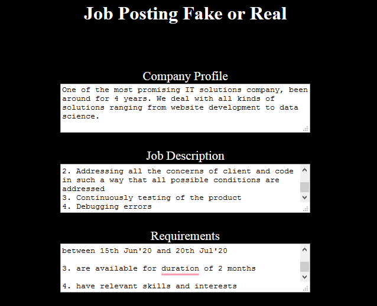
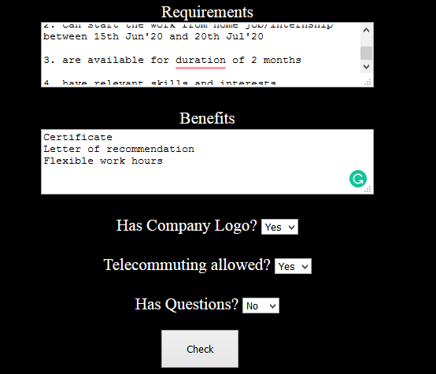
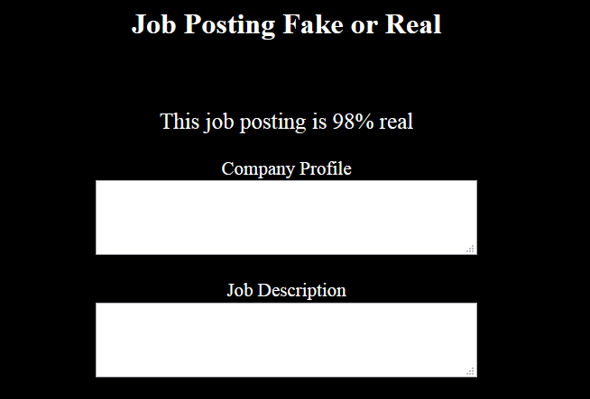

# Fake Job Posting classifier

The project aims to classify the real and the fake job postings posted by various companies. The data set consists of around 18k job postings out of which 800 are fake. 

The model takes inputs such as company profile, job description, requirements and benefits to provide how much are the chances that the job posting is fake.

After submitting the values, the model provides the percentage of how much is the job posting real or fake

There are various reasons a company can post a fake job opening.
Following are some of the reasons explained:

#### 1. Get information about the current talent: 
After posting a fake job opening, a company can successfully get information from the resumes and other social profiles about the current skill sets possessed by the candidates in the industry currently.
It allows an organisation to compare their employees with other candidates in the market.

#### 2. Advertising:
This is used by new startups who want themselves to be known. The more the number of candidates applying, the more the number of candidates will be called for an interview, and the more the number of candidates will get to know about the organisation.

#### 3. Get information regarding the in-demand job:
By posting fake job openings for various positions and profiles, an organisation can come to know which profile is in high demand by the number of candidates applying for that profile.

#### 4. Keep a backup of resources:
In case an employee of the organisation quits suddenly, the candidates applied act as a backup resource.

#### 5. Add information to spam or any other list:
The information obtained from the candidates such as their contact number or email is sold to other companies that then target the candidates for selling their products.

After performing EDA on the real and fake job openings separately some interesting insights were found. The model makes use of TF-IDF vectors to classify the fake job postings.

The dataset was obtained here: https://www.kaggle.com/shivamb/real-or-fake-fake-jobposting-prediction
